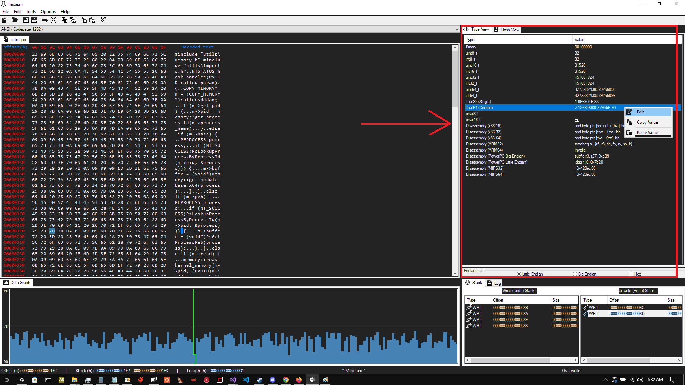
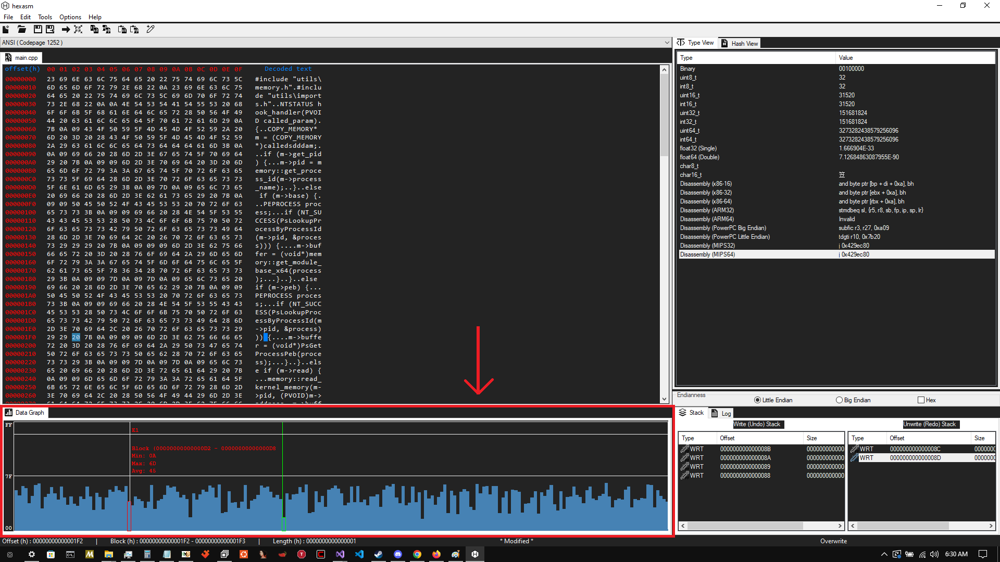

#                                                                                                       hexasm

###                 A Clean Binary File Editor written in C++ / CLI with many feature, which include:

*  Disassembly for many Architectures (thanks to the [Capstone Project](https://github.com/capstone-engine/capstone) !)
*  Complete Data-Interpreter

*  Interactable detailed graph view of the file.

*  Fully-featured Hex Editing control (Based on [Be.HexEditor](https://github.com/Pkcs11Admin/Be.HexEditor))

*  Advanced user-action logging stack to preserve data-integrity

---------------------------------------------------------------------------------------------------------------------------------------------------------------------------------------------------------------------------------------------------------------------------------

# To-Do's / In Progress

* SEVERE need for C# code cleanup in "HexBox.cs" - I do not like to write C#, and without further excuses, lots of my appended code here got sloppy looking, or needs optimization.

* Finish Implementing IByteProvider Interface inside of Be.Windows.Forms.HexBox class "DynamicProcessByteProvider.cs" to allow for Reading && Editing the memory of other processes by the hex editor control

* I am writing a scripting language for hexasm right now which will allow synchronized data bindings to files and processes, this will make user-defined file format diagrams possible, unfortunately requires writing a VM in my case so this may take a month or 2. If you have experience with this sort of thing, feel free to contact me.

* Optimization for the Data Graph loading files and synchronizing with the updated contents within the Hex Editor control

* Optimization for the Clipboard Copy / Paste functions - Copying large amounts of Data will eat CPU usage, and sometimes cause the program to crash

* "wintest.h" is as suggested by the title, a testing environment for another feature being worked on which will allow for the creation of Control-Flow graphs from PE files. The subroutine detections "work" (kind of) but are not quite where i wish them to be and while they are similar to IDA's subroutine breakdown, they do not match, nor do they produce a satisfying result.

---------------------------------------------------------------------------------------------------------------------------------------------------------------------------------------------------------------------------------------------------------------------------------

# Credits

* Thanks to Pkcs11Admin for their old Be.HexEditor project which i extended the functionality of and changed [Be.HexEditor](https://github.com/Pkcs11Admin/Be.HexEditor)

* Thank you to the [Capstone Project](https://github.com/capstone-engine/capstone) for the amazing work

* Credits for many of the icons go directly to [gentleface](http://gentleface.com/), and the remainder were made by myself but heavily inspired by his theme and made to match / fit / extend it
